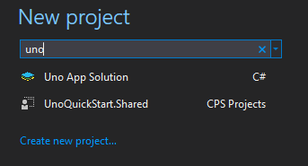

# Uno Quick Start
This repository is a basic sample for an [Uno](http://platform.uno/) application which cross-targets UWP, iOS, Android and WebAssembly.

Use the Visual Studio's UWP tooling on Windows, such as 
[Xaml Edit and Continue](https://blogs.msdn.microsoft.com/visualstudio/2016/04/06/ui-development-made-easier-with-xaml-edit-continue/), C# Edit 
and Continue, then run your app on iOS, Android and Windows.

You can also [try out the experimental WASM build live](http://platform.uno/Playground/index.html).

## Prerequisites
* Visual Studio 2017 15.5 or later, with :
	* Xamarin component, with the iOS Remote Simulator installed
	* A working Mac with Visual Studio for Mac, XCode 8.2 or later installed
	* The google Android x86 emulators
* On Windows
	- Running WASM Project using Python
		- The Linux Subsystem to run the native Python tools
		- Or the Python tools for windows
	- Running WASM Project using Node
		- Node tools (https://nodejs.org/en/)
		- http-server package (https://www.npmjs.com/package/http-server)
			- `npm install npm install http-server -g`

## Create an application from the solution template

To easily create an multi-platform application:
* Install the [Uno Solution Template Visual Studio Extension](https://marketplace.visualstudio.com/items?itemName=nventivecorp.uno-platform-addin)
* Create a new C# solution using the **Cross-Platform Library (Uno Platform)** template, from Visual Studio's **Start Page** :

* Update to the latest nuget package named `Uno.UI`, make sure to check the `pre-release` box.
* To debug the iOS head, select the `Debug|iPhoneSimulator` configuration
* To debug the Android head, select the `Debug|AnyCPU` configuration
* To debug the UWP head, select the `Debug|x86` configuration
* To run the WASM head, locate the `dist` folder in the debug output.
	- Python: run `server.py`. 
		- On Windows, use either:
			- Python tools 
			- The Linux Subsystem: 
				- On the bash prompt, run ``cd `wslpath "C:\YourWindowsPath"` ``
				- Run either `python3 server.py` or `python server.py`.
	- Node: run `http-server ./ -p 8000`
 
An HTTP server on http://localhost:8000 will open.

Note that the WASM head cannot be debugged at this point, the `mono-wasm` SDK does
not provide support for this yet. For more details on the wasm support see 
the [Uno.Wasm.Bootstrap repository](https://github.com/nventive/Uno.Wasm.Bootstrap)
